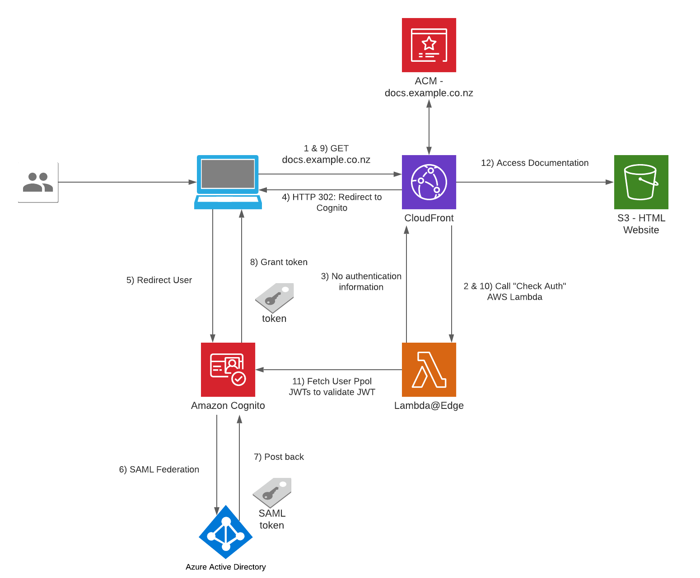
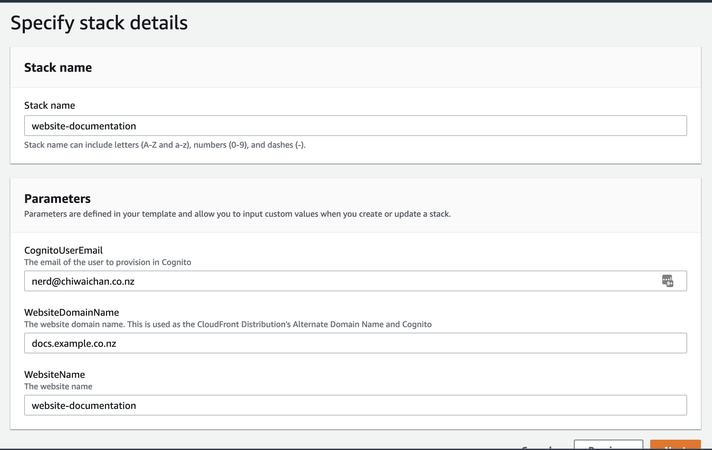
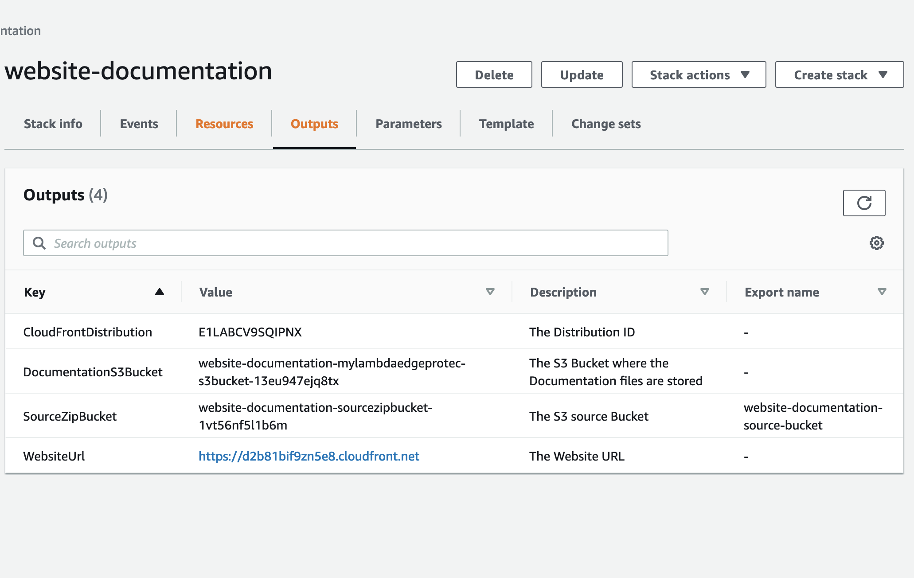
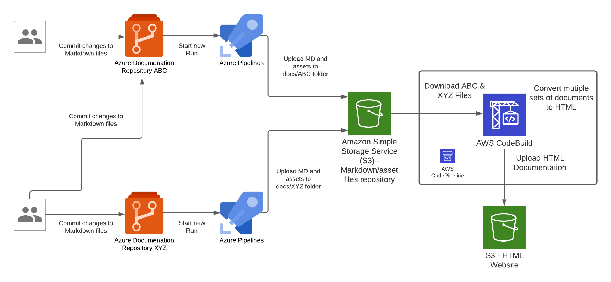
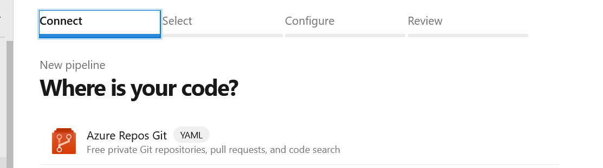
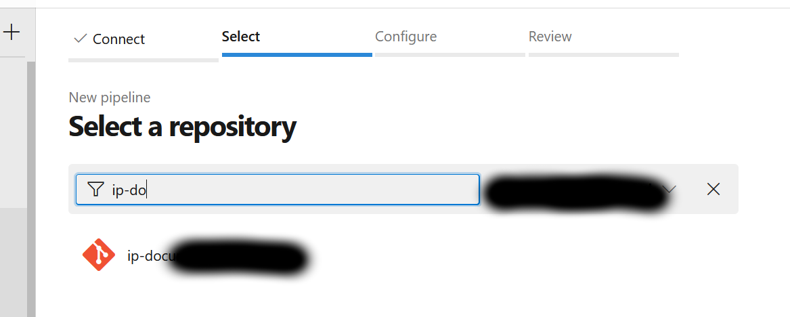
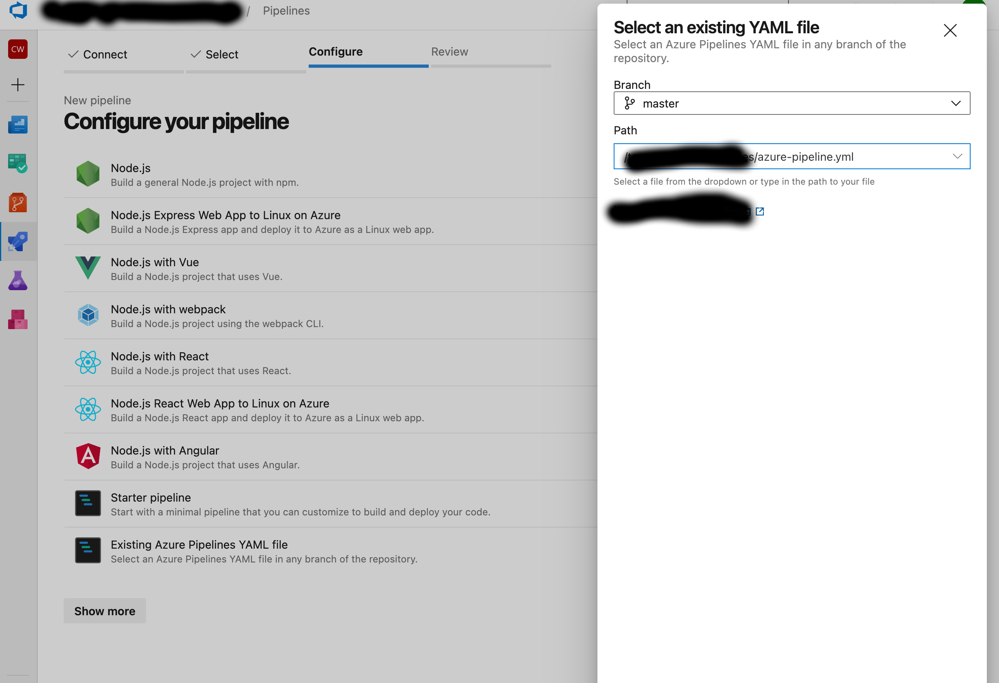
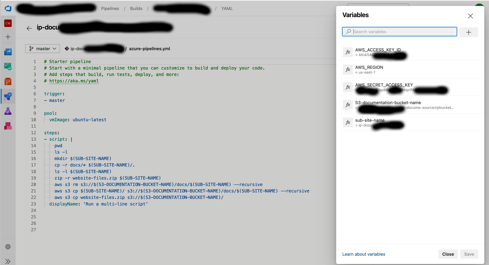
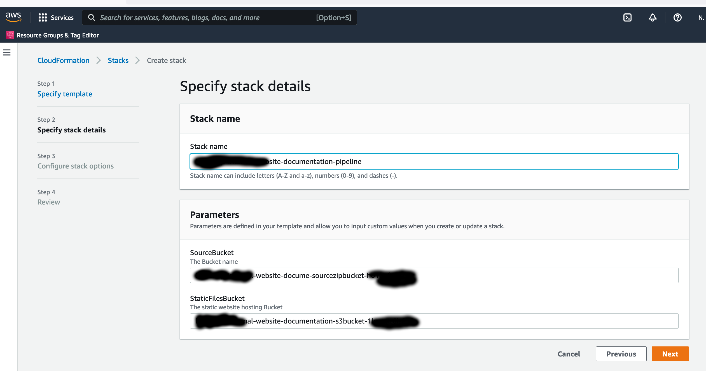

Recently, I was tasked with coming up with a solution for a single website instance to host various pockets of documentations scattered across a growing number of Git repositories; each repository hosted documentation for a specific subject domain written in Markdown format - you may have come across README.md files all over the internet which is a classic example of Markdown.

Here is a list of requirements based on what the solution has to solve:

- Website Hosting: the documentation website must be accessible from anywhere over the public internet. Optionally, we could limit access to a list of whitelisted IPs.
- Authentication: access is only granted to those that should have it. Federating an IdP is ideal, e.g. Azure AD.
- Serverless.
- Host multiple sets of documentation scattered across multiple Azure DevOps Git Repositories.
- Versioning: store each set of documentation in source control for all its goodness.
- Format: create the documentation in plain text without having to worry much about styling and formatting. This is where Markdown file format comes in.
- Pipelines to detect changes to documentation that would in turn trigger builds and deployments.
- Azure AD Federation for SSO, this is especially useful for organisations with many applications and users so existing credentials can be re-used and managed the same way.

# Solution

## Serverless Website Hosting Infrastructure


 
The Serverless Website Hosting Infrastructure I am about to talk about is built on top on an AWS's sample solution found [here](https://aws.amazon.com/blogs/networking-and-content-delivery/authorizationedge-using-cookies-protect-your-amazon-cloudfront-content-from-being-downloaded-by-unauthenticated-users/). I added resources on top of the example to suit our needs.


- The user visits [https://docs.example.co.nz](https://docs.example.co.nz) from a browser on any device.
- CloudFront: We are leveraging this component as the Content Distribution Network for the website, using the standard pattern of serving the CDN using an S3 Bucket. 
    - Successful Lambda@Edge Check Auth: Static website content stored in S3 will only be served if the user is authenticated - a valid JWT (JSON Web Token) is found in the request.
    - Unsuccessful Lambda@Edge Check Auth: Return an HTTP 302 in the response to the user's browser to redirect user to Cognito so the user can sign in
    - This CloudFront instance is configured with the following settings:
        - Website content is cached for 30 minutes, each expired content file will be retrived from S3 individually.
        - Configured with the Alternative Domain Name: docs.example.co.nz
        - Configured with an SSL certificate for the sub-domain docs.example.co.nz using ACM (Amazon Certificate Manager) Service, the certificate is free and will be automatically renewed and managed by AWS.
- Lambda@Edge: Validates every incoming request to CloudFront for the existence of a cookie to see if it contains a user's authentication information/JWT.
    - No authentication information: Respond to Cloudfront that the user needs to login.
    - Contains authentication cookie: Exchange the authentication information for a JWT token and store the JWT in the cookies in the HTTP response.
- S3: This bucket is used as a CloudFront Origin and contains the static content files for the Documentation Website, e.g. HTML/CSS/JS/Images.
- Amazon Cognito: This is the component used as the entry point for Authentication into the website, we will Federate Azure AD as an IdP using SAML integration - the user will be redirected to Azure AD for authentication.
    - Post back: When Cognito receives a SAML Assertion/Token from Azure AD after a successful login, a user's profile of that user is saved into the Cognito's User Pool by collecting the user attributes (claims) from the SAML Assertion.
- Azure Active Directory: This solution will Federate Azure AD into Cognito using SAML, I suggest on following this walkthrough if you have a requirement for Azure AD Federation: [https://aws.amazon.com/blogs/security/how-to-set-up-amazon-cognito-for-federated-authentication-using-azure-ad/](https://aws.amazon.com/blogs/security/how-to-set-up-amazon-cognito-for-federated-authentication-using-azure-ad/)
    - Successful authentication: the IDP posts back a SAML Assertion/Token back to Cognito

## Set up instructions - Website Infrastructure
- Create an AWS CloudFormation stack for the Website Hosting Infrastructure from the existing YML file "[templates/aws-website-infrastructure.yml](templates/aws-website-infrastructure.yml)" found in this repository. We'll need the Stack's Outputs later on when we create the AWS Pipeline.






## Azure DevOps and AWS CodePipeline



There are 2 types of pipelines that makes up the end-to-end pipeline for this solution, 1st type is for the Azure side to push Markdown files into AWS, the other is for AWS to compile the Markdown files and deploy them into S3 where the Website Content is hosted.

In the Azure pipeline we take the raw documentation (Markdown) from a Git repository hosted in Azure DevOps Git Repositories, each time a set code changes is pushed into any one of the Git repositories will trigger an Azure Pipeline "Run", the Azure Pipeline will upload the Markdown and assets files to a centralised S3 bucket repository (created by the Website Infrastructure CloudFormation Stack earlier). 

Each Azure DevOps repository will host documentation for a specific domain topic, this Pipeline pattern is designed to cater for a growing number of repositories that has a requirement to host all documentations within a single Wesbite instance; the Azure Pipeline needs to be configured for each instance of Azure DevOps Git Repository. Once the Markdown files are converted to HTML during the CodeBuild stage of the CodePipeline execution, the output of those files are upload the S3 bucket that is served behind the CloudFront/Website stack.

## Set up instructions - Azure & AWS Pipelines

1. This step is skipped if the infrastruture website was previously set up for the another (first) set of documentation, in this case re-use the Access Keys created at that time in subsequent steps. Create a set of Access Keys for an AWS IAM User with a policy to perform the following actions on the "SourceZipBucket" bucket created in the Website Infrastructure CloudFormation stack earlier:
    - s3:PutObject
    - s3:GetObject
    - s3:DeleteObject
    - s3:ListBucket

 ```
 #example

 {
    "Version": "2012-10-17",
    "Statement": [
        {
            "Sid": "VisualEditor0",
            "Effect": "Allow",
            "Action": [
                "s3:PutObject",
                "s3:GetObject",
                "s3:DeleteObject",
                "s3:ListBucket"
            ],
            "Resource": [
                "arn:aws:s3:::${REPLACE-WITH-SOURCE-ZIP-BUCKET-NAME}/*",
                "arn:aws:s3:::${REPLACE-WITH-SOURCE-ZIP-BUCKET-NAME}"
            ]
        },
        {
            "Sid": "VisualEditor1",
            "Effect": "Allow",
            "Action": "s3:ListAllMyBuckets",
            "Resource": "*"
        }
    ]
}
 ```  
 
2. Create a new ADO pipeline from the existing YML file "[templates/azure-pipeline.yml](templates/azure-pipeline.yml)" in this repository.









Use these as the variables for the Pipeline using the same case:
  - S3-documentation-bucket-name: use the Outputs value of "SourceZipBucket" from the AWS CloudFormation Website Infrastructure Stack created earlier - this is the same S3 bucket name used in the IAM User policy. 
  - AWS_ACCESS_KEY_ID: The value of the Access Key ID created earlier.
  - AWS_SECRET_ACCESS_KEY: The value of the Secret Access Key created earlier.
  - AWS_REGION: The region where the SourceZipBucket was created in. 
  - sub-site-name: This is the name of the URL path for this set of documentation, it could be the name of the Azure DevOps Repository Name for easy reference. E.g. https://docs.example.co.nz/${sub-site-name}

3. Hit Run to start a pipeline execution 
4. Skip this Step if you skipped Step 1. Create a CloudFormation stack for the Pipeline to deploy new Documentation, use the Cloudformation YML file "[templates/aws-pipeline.yml](templates/aws-pipeline.yml)" in this repository.
Use the following as the Parameter values for the Pipeline:
  - SourceBucket: This is the Outputs value of "SourceZipBucket" from the AWS CloudFormation Website Infrastructure Stack created earlier.
  - StaticFilesBucket: This is the Outputs value of "DocumentationS3Bucket" from the AWS CloudFormation Website Infrastructure Stack created earlier.



## Populate the website skeleton for Docusaurus
The CodeBuild instance in the pipeline runs a set of commands that takes the Markdown and asset files, then produces as an output the HTML format equivalent files of the entire website for all sub-sites. In order for the CodeBuild instance to run successfully it expects the skeleton files in the root of the "DocumentationS3Bucket" S3 Bucket found in the Outputs of the Website Infrastructure CloudFormation Stack, this is so Docusaurus knows how to render the Markdown files into HTML.

To generate the skeleton files and upload it to the S3 bucket use the following commands on a local machine:

```
npx create-docusaurus@latest website classic
aws s3 cp website/. s3://${DocumentationS3Bucket}
```
